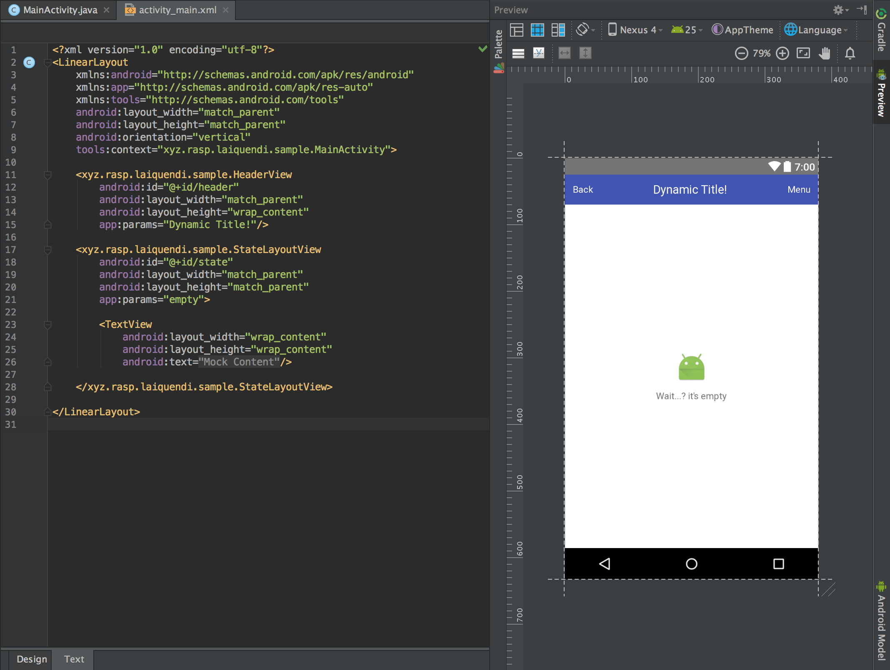

# Laiquendi

[WIP] Light-weight UI component wrapper util for Android

轻量级的 UI 组件封装工具，旨在降低根据业务逻辑封装的 UI 组件复杂性。使用 annotationProcessor 生成 View 代码，并且可在布局文件中预览。（项目仍在开发中尚未稳定）

## Usage

例如封装一个通用的 Header 组件（可使用 ButterKnife 进行界面元素的绑定）：

```java
@ComponentId(R.layout.header)
public class Header implements Component {

    @BindView(R.id.tv_back)   TextView mTvBack;
    @BindView(R.id.tv_header) TextView mTvHeader;
    @BindView(R.id.tv_menu)   TextView mTvMenu;

    @Override
    public void initView(View rootView) {
        ButterKnife.bind(this, rootView);
    }

    public void attach(Activity activity) {
        mTvHeader.setText(activity.getTitle());
        mTvBack.setOnClickListener(v -> activity.onBackPressed());
        mTvMenu.setOnClickListener(v -> activity.openOptionsMenu());
    }

    public void setTitle(String title) {
        mTvHeader.setText(title);
    }
}
```

之后增量 Build 一次，就可以生成名为 [组件名] + View 的自定义控件。例如 `Header` 生成的 View 名称就是 HeaderView
布局中直接使用

```xml
<xyz.rasp.laiquendi.sample.HeaderView
    android:id="@+id/header"
    android:layout_width="match_parent"
    android:layout_height="wrap_content"/>
```

效果图(app:params 为自定义参数，可继承 ParamsComponent 接口来传递一个字符串参数)



在调用的 Activity 或者 View 中直接调用 HeaderView 来获取模块对象即可

```java
Header header = HeaderView.get(this, R.id.header);
```
